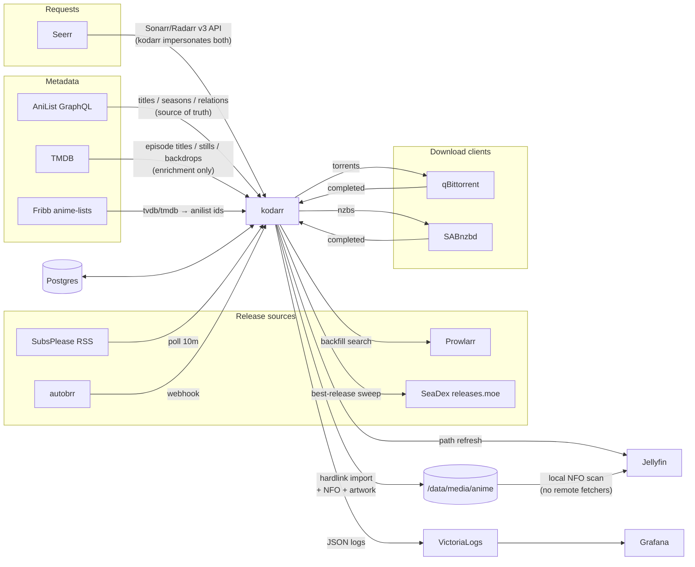

# kodarr

Anime-only Sonarr replacement: one headless daemon, a CLI, and Postgres. No web
UI, no quality profiles, no season mapping — anime is identified by AniList ID,
release group, and absolute episode number, so that's all kodarr models.

## How it fits in



kodarr **replaces** sonarr-anime, radarr-anime, seadexarr, and Shoko/Shokofin.
Regular Sonarr/Radarr/Lidarr keep handling non-anime; Seerr holds both — kodarr
instances for anime, real arrs for everything else. Torrents keep seeding after
import (hardlinks); removing finished seeds stays qBittorrent's/cleanuparr's
job, by category.

## Behavior

- **Grab ladder**: SeaDex usenet > SeaDex torrent > preferred-group (SubsPlease)
  usenet > preferred-group torrent — nothing else, 1080p floor. Airing shows
  arrive via RSS/autobrr; SeaDex upgrades after a season finishes and deletes
  the replaced library file (the old torrent keeps seeding until your policy
  removes it).
- **Layout**: one folder per franchise (AniList prequel-chain root), one
  `Season NN` per AniList entry, `Show SnnEmmm [Group].mkv`, specials in
  Season 00.
- **Metadata**: Kodi NFOs + artwork written at import, refreshed daily. AniList:
  plot, rating, genres, studio, dates, status, Japanese VA cast with images.
  TMDB: episode titles/overviews/stills/air-dates, show backdrops. Each episode
  carries `Source: <release filename>` (BD vs WEB at a glance). Jellyfin scans
  are purely local — configure the library with all remote fetchers OFF.
- Polite by design: AniList throttle + Retry-After, conditional RSS GETs, weekly
  search backoff, failed-release blocklist, stalled-grab expiry.

## Setup

1. **Postgres** — any instance; schema auto-applies on start.
2. **Config** — `cp config.example.toml config.toml`; secrets may come from env:
   `KODARR_DB_DSN`, `KODARR_JELLYFIN_API_KEY`, `KODARR_PROWLARR_API_KEY`,
   `KODARR_SAB_API_KEY`, `KODARR_QBIT_USER/PASS`, `KODARR_WEBHOOK_TOKEN`,
   `KODARR_TMDB_API_KEY` (optional, strongly recommended).
3. **Jellyfin** — anime library on the anime root, every metadata/image fetcher
   disabled; set `[jellyfin] path_from/path_to` if kodarr and Jellyfin mount the
   media at different paths.
4. **Seerr** — add kodarr as BOTH the default Sonarr and Radarr server: host
   `kodarr`, port `7878`, API key = webhook token. With `[upstream]` configured,
   kodarr proxies anything without an AniList mapping straight to your real
   Sonarr/Radarr — anime and non-anime route automatically through one server
   entry (seerr can't switch servers by genre on its own).
5. **autobrr** (optional) — webhook action `POST /webhook/autobrr`, header
   `X-Kodarr-Token: <token>`, payload
   `{"release_name": "{{ .TorrentName }}", "download_url": "{{ .TorrentUrl }}"}`.
6. **Run** — `kodarr run`, or deploy `deploy/flux/` (Flux + bjw-s app-template;
   image `ghcr.io/npgo22/kodarr` from CI; Grafana dashboard CR included, expects
   a VictoriaLogs datasource).

CLI: `add <search|id> [--offset N] [--show-root ID] [--season N]`, `list`,
`remove`, `backfill [--dry-run]`, `seadex [--force]`, `import <path> [--seadex]`,
`nfo`, `run [--dry-run]`.

## Dev

```sh
uv sync && uv run pytest   # unit + integration (integration needs docker)
```
