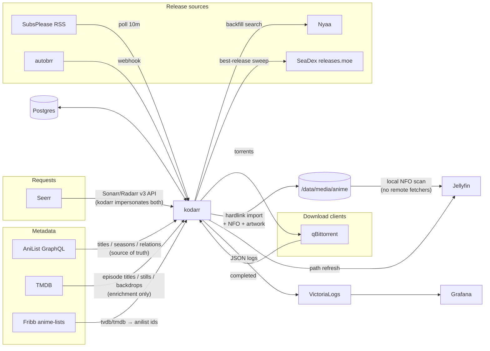

# kodarr

Anime-only Sonarr replacement: one headless daemon, a CLI, and Postgres. No web
UI, no quality profiles, no season mapping — anime is identified by AniList ID,
release group, and absolute episode number, so that's all kodarr models.

## How it fits in



kodarr **replaces** sonarr-anime, radarr-anime, seadexarr, and Shoko/Shokofin.
Regular Sonarr/Radarr/Lidarr keep handling non-anime; Seerr holds both — kodarr
instances for anime, real arrs for everything else. Torrents keep seeding after
import (hardlinks); removing finished seeds stays qBittorrent's/cleanuparr's
job, by category.

## Behavior

- **Grab ladder**: SeaDex best release > preferred-group (SubsPlease) torrent —
  torrent-only, nothing else, 1080p floor. SeaDex magnets are exact curated
  content; SubsPlease/SeaDex seeding is excellent, and torrents can't import
  the wrong show the way usenet name-matching could. Airing shows arrive via
  RSS/autobrr; SeaDex upgrades after a season finishes and deletes the replaced
  library file (the old torrent keeps seeding until your seed policy removes it).
- **Layout**: one folder per franchise (AniList prequel-chain root), one
  `Season NN` per AniList entry, `Show SnnEmmm [Group].mkv`, specials in
  Season 00.
- **Metadata**: Kodi NFOs + artwork written at import, refreshed daily. AniList:
  plot, rating, genres, studio, dates, status, Japanese VA cast with images.
  TMDB: episode titles/overviews/stills/air-dates, show backdrops. Each episode
  carries `Source: <release filename>` (BD vs WEB at a glance). Jellyfin scans
  are purely local — configure the library with all remote fetchers OFF.
- Polite by design: AniList throttle + permanent response cache, conditional RSS
  GETs, weekly search backoff, stalled-grab expiry. Failed grabs are retryable —
  qbit dedupes by infohash, so retries are free and self-heal after fixes.

## Setup

1. **Postgres** — any instance; schema auto-applies on start.
2. **Config** — `cp config.example.toml config.toml`; secrets may come from env:
   `KODARR_DB_DSN`, `KODARR_JELLYFIN_API_KEY`, `KODARR_QBIT_USER/PASS`,
   `KODARR_WEBHOOK_TOKEN`, `KODARR_TMDB_API_KEY` (optional, recommended),
   `KODARR_UPSTREAM_SONARR/RADARR_API_KEY` (non-anime passthrough).
3. **Jellyfin** — anime library on the anime root, every metadata/image fetcher
   disabled; set `[jellyfin] path_from/path_to` if kodarr and Jellyfin mount the
   media at different paths.
4. **Seerr** — add kodarr as a Sonarr and a Radarr server (host `kodarr`,
   port `7878`, API key = webhook token) alongside your real arrs. Routing is
   seerr's job: keep the real arrs as defaults and pick the kodarr server for
   anime requests. kodarr answers empty for anything without an AniList
   mapping.
5. **autobrr** (optional) — webhook action `POST /webhook/autobrr`, header
   `X-Kodarr-Token: <token>`, payload
   `{"release_name": "{{ .TorrentName }}", "download_url": "{{ .TorrentUrl }}"}`.
6. **Run** — `kodarr run`, or deploy `deploy/flux/` (Flux + bjw-s app-template;
   image `ghcr.io/npgo22/kodarr` from CI; Grafana dashboard CR included, expects
   a VictoriaLogs datasource).

CLI: `add <search|id> [--offset N] [--show-root ID] [--season N]`, `list`,
`remove`, `backfill [--dry-run]`, `seadex [--force]`, `import <path> [--seadex]`,
`nfo`, `run [--dry-run]`.

## Scope & shortcomings

kodarr is a **single-admin, internal-only service** for a trusted network. It
has no user accounts, no TLS, and a single shared API token — never expose it
publicly; user-facing access goes through Seerr (behind your SSO). Known
limits, by design or honestly unsolved:

- **Anime only, one grab policy.** No quality profiles or custom formats — the
  ladder is SeaDex > preferred group at 1080p+, take it or fork it. Non-anime
  is out of scope: seerr routes it to your real Sonarr/Radarr.
- **Coverage is bounded by its sources.** Requests need a Fribb id mapping
  (~8k anime); shows without SubsPlease or SeaDex releases (old OVAs, obscure
  titles) sit at 0 files unless you point autobrr at them or import manually.
  Episode titles/stills need a TMDB mapping.
- **Filename parsing, not hashes.** Matching is anitopy + AniList synonyms —
  reliable for known groups, but a weirdly named release logs `match_fail`
  instead of importing (watch the Grafana panel). Shoko's ed2k-hash certainty
  is the trade-off we gave up for zero maintenance.
- **Franchise grouping trusts AniList relations.** Pathological graphs
  (Monogatari) need manual `--show-root`/`--season` overrides.
- **No missing-episode placeholders in Jellyfin** — NFOs can't create virtual
  items; you only see what's on disk.
- **Season packs**: extras (S00) inside packs are skipped, not imported as
  specials; multi-episode files get one episode number.
- The Sonarr/Radarr API surface is the subset Seerr calls — it is not a
  general Sonarr replacement for other tools.

## Dev

```sh
uv sync && uv run pytest   # unit + integration (integration needs docker)
```
