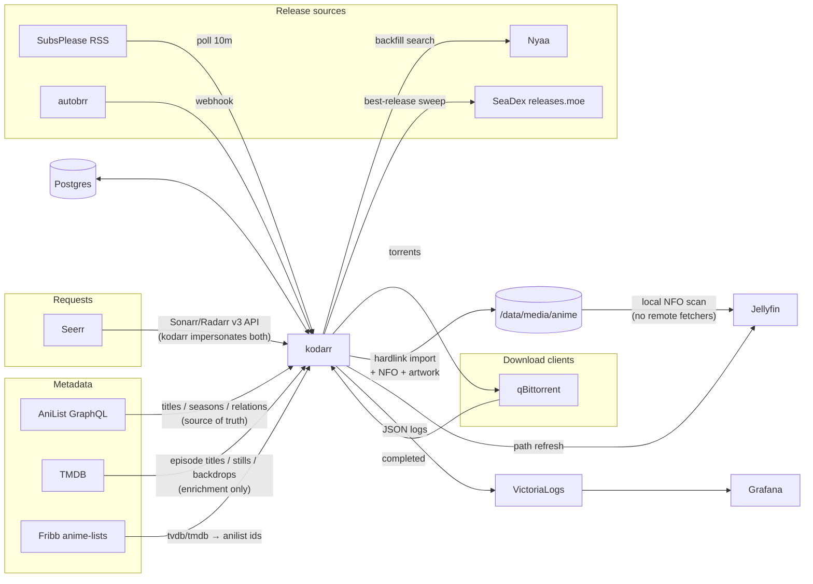

# kodarr

A small daemon that manages an anime library the way anime actually works,
instead of the way Western TV databases think it works.

## Why this exists

Sonarr models television as TVDB does: one show, numbered seasons, episodes
inside them. Anime doesn't fit that model. A "season" is often several
separately-catalogued cours, sometimes split by an OVA or a movie in the
middle. Release groups number episodes absolutely, per cour, or by their own
scheme. Season mappings between databases are maintained by hand, go stale,
and silently misfile episodes. Layered on top: Sonarr's metadata flows through
hosted relay services that go down, and media servers fetch metadata from
remote APIs at scan time — slow, rate-limited, and wrong for anime.

kodarr replaces that stack for anime with one opinionated pipeline built on
the database that actually understands anime — AniList — plus SeaDex, the
community's curated index of the best release of each show.

## What it must do (the contract)

- Track anime by **AniList entry**. One entry per cour/movie/OVA, grouped
  into one library "show" per franchise via AniList's own relation graph.
- Catch **airing episodes** from the preferred release group (RSS/autobrr),
  and **backfill** missing ones from Nyaa.
- **Upgrade** each finished season to its SeaDex-curated best release, then
  leave it alone.
- **Organize** files as `Show/Season NN/Show SnnEmmm [Group].ext` with
  hardlinks (torrents keep seeding; removal is the download client's job).
- Write **all metadata locally** (Kodi NFOs + artwork) at import time, so
  media-server scans are instant, offline, and deterministic.
- Answer the **Sonarr/Radarr API subset Seerr calls**, so requests work and
  availability reports back — a request pulls the entire franchise.
- Stay a **polite API citizen**: batched queries, permanent caching of
  immutable data, global rate limiting, staggered schedules.

## What it refuses to do (limitations on purpose)

- **No quality profiles, custom formats, or scoring.** The policy is fixed:
  preferred group at 1080p+ while airing, SeaDex best after. Configurability
  here is where the *arr complexity explosion starts; if you need it, use
  Sonarr.
- **No usenet.** Torrent infohashes guarantee content identity; usenet
  name-matching was the source of every wrong-content incident this project
  ever had.
- **No web UI, no users, no TLS.** It is a single-admin internal service;
  humans interact through Seerr and the media server, admins through the CLI.
- **No non-anime.** Seerr routes those requests to real Sonarr/Radarr.
- **No general-purpose arr API.** Only what Seerr calls is implemented.

## Honest limitations (not on purpose, just true)

- **Filename parsing, not file hashes.** Matching is anitopy + AniList
  synonyms. Known groups parse reliably; a bizarrely named release logs
  `match_fail` and waits for a human. Hash-certain identification (AniDB
  ed2k) would need a client registration and a much bigger matcher.
- **Requests are bounded by the id mapping.** Seerr speaks TVDB/TMDB ids;
  the community mapping table covers ~8k anime. Unmapped titles can't be
  requested (add by AniList id via CLI instead).
- **Franchise grouping trusts AniList relations.** Non-linear graphs
  need manual `--show-root`/`--season` overrides.
- **Episode titles/stills come from TMDB** where a mapping exists; obscure
  entries fall back to "Episode N".
- **No virtual "upcoming episode" entries** in the media server — NFO-based
  metadata can only describe files that exist.
- **Season-pack extras (S00 specials) are skipped**, not imported to their
  own entries.

## How it fits in



## Layout

```
src/kodarr/
  cli.py daemon.py api.py     entry points: CLI, scheduler loops, HTTP surface
  config.py db.py log.py      config, Postgres (schema.sql), JSON logging
  clients.py                  qBittorrent + Jellyfin
  metadata/                   anilist (source of truth), tmdb (enrichment),
                              mapping (tvdb/tmdb -> anilist ids), nfo (writer)
  acquire/                    feeds (RSS/Nyaa), announce (RSS+autobrr grabs),
                              backfill (Nyaa search), seadex (upgrade sweep)
  library/                    match (release-name -> entry), organize (paths,
                              hardlinks), importer (completed downloads -> library)
```

## Setup

1. **Postgres** — any instance; the schema applies itself on start.
2. **Config** — `cp config.example.toml config.toml`; secrets can come from
   env (`KODARR_DB_DSN`, `KODARR_JELLYFIN_API_KEY`, `KODARR_QBIT_USER/PASS`,
   `KODARR_WEBHOOK_TOKEN`, `KODARR_TMDB_API_KEY`).
3. **Jellyfin** — point the anime library at the anime root with every
   remote metadata/image fetcher disabled; NFOs supply everything. Set
   `[jellyfin] path_from/path_to` if mounts differ.
4. **Seerr** — add kodarr as a Sonarr and a Radarr server (host `kodarr`,
   port `7878`, API key = webhook token) alongside the real arrs; pick the
   kodarr server for anime requests.
5. **autobrr** (optional) — webhook action to `POST /webhook/autobrr` with
   header `X-Kodarr-Token` and payload
   `{"release_name": "{{ .TorrentName }}", "download_url": "{{ .TorrentUrl }}"}`.
6. **Run** — `kodarr run`, or the Flux manifests in `deploy/flux/`
   (image `ghcr.io/npgo22/kodarr`, Grafana dashboard CR included).

CLI: `add <search|id> [--offset N] [--show-root ID] [--season N]`, `list`,
`remove`, `backfill [--dry-run]`, `seadex [--force]`, `import <path>`,
`nfo`, `run [--dry-run]`.

## Development

```sh
uv sync && uv run pytest   # unit + integration (integration needs docker)
```

Test fixtures use real release names and catalog entries deliberately —
release-name parsing depends on exact strings, and the corpus encodes every
naming convention that has ever broken matching.
